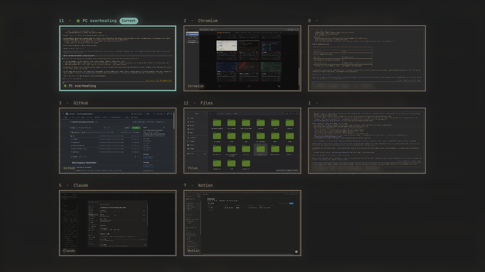

# Workspace Switcher

Alt + Tab for Omarchy workspaces.

Fork of [antoniowav/omarchy-workspace-switcher](https://github.com/antoniowav/omarchy-workspace-switcher),
rebound to Alt + Tab so Super + Tab stays free for window cycling.

- **Tap Alt + Tab** to flip to the workspace you were on before. Tap it again to flip back.
- **Hold Alt and press Tab** to see every workspace in order of visit, current first,
  with live previews of its windows. Each Tab moves to the next most recent one
  (Shift + Tab goes back), and letting go of Alt switches to it.
- Click a window to focus it, or click empty space in a card to go to that workspace.
  The arrow keys and Return work too, and Escape closes it.
- Each window is labelled with its app's name. Terminals show what they are doing
  instead: a Claude Code session's name (as the top bar shows it), the folder of a
  shell prompt, or the running program's title.



## Install

```bash
omarchy plugin add https://github.com/IsseyShiitake/omarchy-workspace-switcher --enable
```

Alt + Tab works as soon as the plugin is enabled.

## Touchpad gestures (optional)

To open the switcher with a three-finger swipe up and close it with a swipe down, add
these lines to `~/.config/hypr/input.lua` (or to `hyprland.lua` on a flat config):

```lua
hl.gesture({ fingers = 3, direction = "up", action = function() hl.dispatch(hl.dsp.global("io.github.antoniowav.workspace-switcher:toggle")) end })
hl.gesture({ fingers = 3, direction = "down", action = function() hl.dispatch(hl.dsp.global("io.github.antoniowav.workspace-switcher:close")) end })
```

The plugin doesn't add them for you: Hyprland can't remove a gesture once it is added,
and you may already use these swipes for something else.

## How it changes your key bindings

While the plugin is enabled it takes over three bindings at runtime, with `hyprctl
eval`. It never edits your config files.

| Keys | With the plugin |
|---|---|
| Alt + Tab | Flip to the previous workspace, or hold Alt to cycle |
| Alt + Shift + Tab | Cycle backwards |
| Letting go of Alt | Switch to the selected workspace (only after Alt + Tab) |

Letting go of Alt is passed on to apps as usual. Super + Tab is never touched:
whatever you have bound there (window cycling, Omarchy's next workspace, …)
works exactly as before, with the plugin enabled or disabled.

Other plugins that take Alt + Tab conflict with this one: enable only one of them.

## Configuration

Two settings, at the top of `WorkspaceSwitcher.qml`:

- `accentTint` (default `true`) washes the backdrop with a whisper of the
  theme's popup-border color. Set it to `false` for a plain theme background.
  Light/dark always follows the active theme.
- `numericOrder` (default `true`) displays the cards in number order
  (1, 2, 3, …) instead of order of visit. A tap still flips to the workspace
  you were on before — the highlight just starts there; further Tabs walk the
  cards as displayed. Set it to `false` for visit-ordered cards, current first.

Workspaces you haven't visited since the shell started are listed last, in
number order. The order starts fresh when the shell restarts.

## Requirements

Omarchy 4 (Quattro) with its Quickshell shell and Hyprland 0.56 or later. No other
dependencies. The plugin runs `hyprctl` to read your workspaces and windows, to switch
workspaces, and to set the key bindings above. It needs no network access and no
privileges.

## Remove

```bash
omarchy plugin remove io.github.antoniowav.workspace-switcher
```

If you added the gesture lines, remove them from `~/.config/hypr/input.lua` too.

## Development

The logic is in `WorkspaceSwitcherLogic.js` and is tested with `node test/logic-test.js`.

## License

MIT. See [LICENSE](LICENSE).
